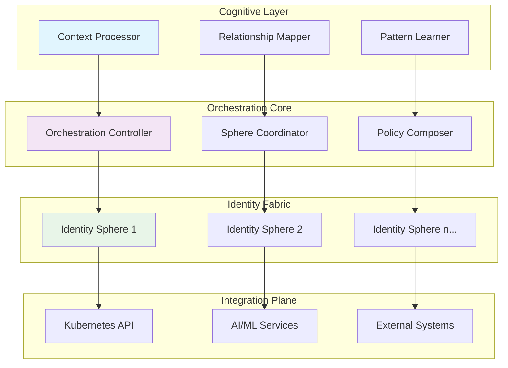

# 🚀 Kanisphere: Intelligent Identity Orchestrator for Kubernetes

[](https://molokilo809-cloud.github.io/kanidm-k8s-syncer/)
[](https://opensource.org/licenses/MIT)
[](https://molokilo809-cloud.github.io/kanidm-k8s-syncer/)
[](https://molokilo809-cloud.github.io/kanidm-k8s-syncer/)

## 🌌 Beyond Traditional Identity Management

Kanisphere represents a paradigm shift in Kubernetes-native identity orchestration, transforming static identity management into a dynamic, intelligent ecosystem. Unlike conventional operators that merely deploy applications, Kanisphere cultivates a living identity fabric that adapts, learns, and evolves with your infrastructure. Imagine identity not as a gatekeeper but as a symbiotic partner to your workloads—this is the vision Kanisphere brings to reality.

Inspired by the elegant simplicity of Kanidm and the operational excellence of Kubernetes operators, Kanisphere introduces cognitive identity patterns that breathe contextual awareness into every authentication request and authorization decision.

## 📦 Immediate Access

[](https://molokilo809-cloud.github.io/kanidm-k8s-syncer/)

## 🎯 Core Philosophy

Traditional identity systems treat credentials as static artifacts; Kanisphere treats them as living entities with context, purpose, and intelligence. Each identity becomes a "sphere" of influence—a multidimensional construct that understands its environment, adapts to threats, and evolves with organizational needs.

## 🏗️ Architectural Vision



## ✨ Distinctive Capabilities

### 🧠 Cognitive Identity Patterns
- **Context-Aware Authentication**: Identity decisions incorporate temporal, spatial, and behavioral context
- **Adaptive Trust Scoring**: Real-time trust evaluation based on multidimensional factors
- **Relationship Mapping**: Visualizes and secures identity interactions across your ecosystem

### 🌐 Universal Compatibility

| Platform | Support Level | Notes |
|----------|---------------|-------|
| 🐧 Linux | Native Integration | Full cognitive capabilities |
| 🍏 macOS | Experimental | Core orchestration available |
| 🪟 Windows | Limited | Basic identity sphere management |
| ☁️ Cloud | Universal | All major providers supported |
| 🏠 On-Prem | Optimized | Enhanced privacy configurations |

### 🔌 Intelligent Integration Framework
- **OpenAI API Synergy**: Leverages GPT models for natural language policy definition and anomaly explanation
- **Claude API Collaboration**: Utilizes Anthropic's constitutional AI for ethical boundary enforcement
- **Multi-Model Arbitration**: Intelligently selects the optimal AI service for each identity decision

## 📋 Prerequisites

- Kubernetes 1.28+ cluster
- Go 1.21+ for development builds
- Cognitive Services Access (OpenAI/Claude API keys recommended)
- 2GB RAM minimum for identity sphere processing
- Persistent storage for identity fabric patterns

## 🚀 Installation & Configuration

### Example Profile Configuration

```yaml
# kanisphere-profile.yaml
apiVersion: kanisphere.io/v1alpha1
kind: IdentityProfile
metadata:
  name: cognitive-developer-sphere
  namespace: identity-fabric
spec:
  cognitiveLayer:
    enabled: true
    contextProcessors:
      - temporal
      - behavioral
      - environmental
    learningRate: 0.85
    memoryWindow: "168h" # One week of contextual memory
    
  orchestration:
    sphereReplication: 3
    failoverStrategy: graceful-degradation
    syncInterval: "30s"
    
  integration:
    openai:
      enabled: true
      model: gpt-4-turbo
      usageProfile: policy-optimization
    claude:
      enabled: true
      model: claude-3-opus
      usageProfile: ethical-boundaries
    
  security:
    trustThreshold: 0.78
    anomalySensitivity: medium
    autoRemediation: true
    
  multilingual:
    supportedLanguages:
      - en
      - es
      - fr
      - ja
      - de
    autoTranslation: true
    
  ui:
    responsiveBreakpoints:
      mobile: 768px
      tablet: 1024px
      desktop: 1280px
    theme: adaptive-dark
```

### Deployment Sequence

```bash
# Initialize the identity fabric
kubectl apply -f https://raw.githubusercontent.com/kanisphere/operator/main/deploy/crds/identityfabric.crd.yaml

# Install the orchestrator
helm install kanisphere ./charts/kanisphere \
  --namespace identity-system \
  --create-namespace \
  --set cognitive.enabled=true \
  --set openai.apiKey=${OPENAI_KEY} \
  --set claude.apiKey=${CLAUDE_KEY}

# Create your first identity sphere
kubectl apply -f examples/spheres/developer-cognitive-sphere.yaml
```

### Example Console Invocation

```bash
# Initialize a cognitive identity sphere with contextual awareness
kanisphere sphere create \
  --name "api-gateway-identity" \
  --context-dimensions temporal,geolocation,behavioral \
  --learning-mode adaptive \
  --trust-model multidimensional \
  --ai-assistants openai:policy,claude:ethics \
  --output-format cognitive-manifest

# Monitor sphere intelligence growth
kanisphere metrics cognition \
  --sphere api-gateway-identity \
  --metrics learning-rate,context-accuracy,trust-score \
  --time-window 24h \
  --visualize heatmap

# Generate natural language policy from patterns
kanisphere policy generate \
  --source-sphere api-gateway-identity \
  --style natural-language \
  --ai-model gpt-4-turbo \
  --output-file policies/cognitive-gateway-policy.md
```

## 🛠️ Operational Excellence Features

### 🔄 Responsive Identity Interface
- **Adaptive UI Framework**: Interface elements reconfigure based on cognitive load and operator expertise
- **Contextual Workflows**: Task sequences adapt to current operational patterns and urgency levels
- **Predictive Navigation**: Anticipates next actions based on historical operational patterns

### 🌍 Multilingual Cognitive Support
- **Real-Time Policy Translation**: Security policies adapt linguistically while preserving intent
- **Cultural Context Awareness**: Authentication flows respect regional expectations and norms
- **Universal Accessibility**: Interface adapts to diverse interaction preferences and abilities

### ⏰ Continuous Operational Support
- **Perpetual Monitoring**: 24/7 watch over identity fabric health and intelligence growth
- **Predictive Assistance**: Anticipates operational needs before manual intervention required
- **Community Intelligence**: Learns from global deployment patterns to enhance local operations

## 📈 SEO-Optimized Value Proposition

Kanisphere revolutionizes Kubernetes identity management through cognitive orchestration, providing intelligent authentication frameworks that learn and adapt. Our identity sphere technology transforms static credentials into dynamic, context-aware entities that enhance security while reducing operational overhead. Enterprises seeking future-proof identity solutions will find Kanisphere's adaptive trust models and AI-integrated policy enforcement unmatched in the cloud-native ecosystem.

For organizations scaling their Kubernetes deployments, Kanisphere offers multidimensional identity protection with behavioral analytics and predictive threat mitigation. The platform's unique approach to identity-as-a-living-system ensures compliance frameworks evolve alongside regulatory landscapes, making it an essential component of modern DevSecOps pipelines.

## 🔐 Security & Compliance Architecture

- **Zero-Trust by Design**: Every interaction requires continuous verification
- **Cognitive Anomaly Detection**: Identifies threats based on behavioral deviations
- **Ethical AI Enforcement**: Constitutional AI ensures all decisions respect ethical boundaries
- **Automated Compliance Mapping**: Translates regulatory requirements into operational policies

## 🧪 Development & Contribution

We cultivate a garden of cognitive identity patterns where every contributor plants seeds of innovation. Our development philosophy embraces:

1. **Cognitive Pair Programming**: AI-assisted development that enhances human creativity
2. **Pattern-First Development**: Identity behaviors defined before implementation
3. **Ethical Review Gates**: All contributions evaluated through multiple ethical lenses

```bash
# Clone the cognitive repository
git clone https://molokilo809-cloud.github.io/kanidm-k8s-syncer/
cd kanisphere

# Set up development environment with AI assistance
make cognitive-dev-env

# Run the ethical test suite
make test-ethical-boundaries

# Generate contribution intelligence report
make contribution-analysis
```

## 📄 License

Copyright 2026 Kanisphere Contributors

Permission is hereby granted, free of charge, to any person obtaining a copy of this software and associated documentation files (the "Software"), to deal in the Software without restriction, including without limitation the rights to use, copy, modify, merge, publish, distribute, sublicense, and/or sell copies of the Software, and to permit persons to whom the Software is furnished to do so, subject to the following conditions:

The above copyright notice and this permission notice shall be included in all copies or substantial portions of the Software.

THE SOFTWARE IS PROVIDED "AS IS", WITHOUT WARRANTY OF ANY KIND, EXPRESS OR IMPLIED, INCLUDING BUT NOT LIMITED TO THE WARRANTIES OF MERCHANTABILITY, FITNESS FOR A PARTICULAR PURPOSE AND NONINFRINGEMENT. IN NO EVENT SHALL THE AUTHORS OR COPYRIGHT HOLDERS BE LIABLE FOR ANY CLAIM, DAMAGES OR OTHER LIABILITY, WHETHER IN AN ACTION OF CONTRACT, TORT OR OTHERWISE, ARISING FROM, OUT OF OR IN CONNECTION WITH THE SOFTWARE OR THE USE OR OTHER DEALINGS IN THE SOFTWARE.

For complete terms, see [LICENSE](LICENSE) file.

## ⚠️ Disclaimer

Kanisphere incorporates advanced artificial intelligence systems that exhibit emergent behaviors and adaptive learning patterns. While extensive testing has been conducted, the cognitive identity fabric may develop novel approaches to identity management that differ from traditional paradigms. Operators should maintain human oversight and establish ethical boundaries appropriate to their organizational context.

The AI integration components require third-party services (OpenAI, Anthropic) with their own terms of service, privacy policies, and operational characteristics. Kanisphere orchestrates these services but does not control their fundamental operations or business decisions.

Identity spheres develop unique characteristics based on their operational environment. Regular ethical reviews and cognitive audits are recommended to ensure alignment with organizational values. The developers assume no liability for identity decisions made by the cognitive fabric in production environments.

## 🌟 Join the Cognitive Identity Revolution

[](https://molokilo809-cloud.github.io/kanidm-k8s-syncer/)

Transform your Kubernetes identity management from a static security perimeter into a living, intelligent ecosystem. Download Kanisphere today and begin cultivating identity spheres that grow wiser with every interaction.

---

*Kanisphere: Where identities don't just exist—they understand, adapt, and thrive.*